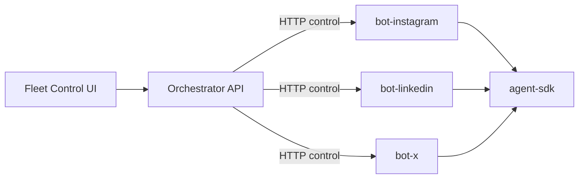

# Social Agent Platform

Plug-and-play observation bots for social networks, plus a local **Fleet Control** orchestrator.

This repository is structured as **independent packages** that mirror separate GitHub repos. Clone the whole tree, or extract any package into its own repo later.

```text
.
├── agent-sdk/          # shared bot contract + control API + safety/LLM helpers
├── bot-instagram/      # Instagram trend bot (fully wired)
├── bot-linkedin/       # LinkedIn stub (same control API)
├── bot-x/              # X stub (same control API)
└── orchestrator/       # control plane + Fleet Control UI
```



## What to clone

| Goal | Packages |
|------|----------|
| Instagram only (CLI) | `agent-sdk` + `bot-instagram` |
| Full fleet + dashboard | all five packages |
| Add a new network later | copy a stub bot, implement pipeline, add to `orchestrator.yaml` |

## Quick start (Windows PowerShell)

```powershell
cd agent-sdk
python -m venv ..\.venv
..\.venv\Scripts\Activate.ps1
pip install -e .
cd ..\bot-instagram
pip install -e .
playwright install chromium
copy .env.example .env
# set MOONSHOT_API_KEY

cd ..\bot-linkedin
pip install -e .
cd ..\bot-x
pip install -e .
cd ..\orchestrator
pip install -e .

python -m orchestrator_app.main
# open http://127.0.0.1:7400
```

In Fleet Control:

1. Select **Instagram**
2. **Boot API**
3. **Run once** (sample/offline) to verify controls
4. Edit **Direction** (hashtags / pillars) and save
5. For live Instagram: set API key, run ingest once to log in, then **Run once** without sample

## Control contract (every bot)

| Method | Path | Purpose |
|--------|------|---------|
| GET | `/health` | Liveness |
| GET | `/status` | State, step, usage, artifacts |
| POST | `/run` | `{ "mode": "once" \| "daemon" }` |
| POST | `/pause` `/resume` `/stop` | Lifecycle |
| GET/PUT | `/direction` | Goals, hashtags, pillars |

States: `idle | running | paused | error | stopped`.

## Split into separate GitHub repos

Each top-level folder is self-contained (`pyproject.toml`, `README`, `.gitignore`). To split:

1. Create empty repos: `agent-sdk`, `bot-instagram`, `bot-linkedin`, `bot-x`, `orchestrator`
2. Copy each folder into its repo and push
3. Point bots at `agent-sdk` via editable install or git dependency
4. Keep `orchestrator.yaml` paths as sibling clones under `D:\GitHub\`

## Safety

All bots are **observation-only** by default — no likes, comments, follows, or posts.
