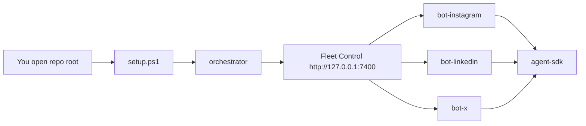

# Social Agent Platform

Plug-and-play observation bots + a local **Fleet Control** dashboard.

```text
.
├── agent-sdk/          # shared control contract (always required by bots)
├── bot-instagram/      # Instagram bot
├── bot-linkedin/       # LinkedIn stub
├── bot-x/              # X stub
├── orchestrator/       # Fleet Control UI
├── setup.py / setup.ps1
└── platform.manifest.yaml
```

---

## What should I clone?

**Clone this repo only** (the platform):

```powershell
cd D:\GitHub
git clone https://github.com/kashewknutt/instagram-bot.git
cd instagram-bot
```

You do **not** need to clone `agent-sdk` / bots separately while they still live in this monorepo.  
`setup` will pull any missing package folders automatically (including if you later clone a single package alone).

---

## What should I open in Cursor?

| You want… | Open this folder |
|-----------|------------------|
| **Recommended — dashboard + all bots** | `D:\GitHub\instagram-bot` (repo root) |
| Instagram CLI only | `D:\GitHub\instagram-bot\bot-instagram` |
| Dashboard code only | `D:\GitHub\instagram-bot\orchestrator` |

For day-to-day control of agents, open the **repo root**, then run the orchestrator and use the browser UI.

---

## Setup (Windows)

```powershell
cd D:\GitHub\instagram-bot
.\setup.ps1
```

You'll be asked what you need:

1. **instagram** — Instagram bot only  
2. **fleet** — Full fleet + Fleet Control (recommended)  
3. **orchestrator-ig** — Dashboard + Instagram (no LinkedIn/X)

Or non-interactive:

```powershell
.\setup.ps1 -Profile fleet
# or
python setup.py --profile instagram
```

Then:

```powershell
.\.venv\Scripts\Activate.ps1
# Edit bot-instagram\.env → set MOONSHOT_API_KEY
python -m orchestrator_app.main
# Open http://127.0.0.1:7400
```

In Fleet Control: select **Instagram** → **Boot API** → **Run once**.

---

## Setup (macOS / Linux)

```bash
cd ~/GitHub/instagram-bot
chmod +x setup.sh
./setup.sh --profile fleet
source .venv/bin/activate
python -m orchestrator_app.main
```

---

## If you clone a single package later

Each package can fetch the rest:

```powershell
# Example: only cloned orchestrator
cd D:\GitHub\orchestrator
python bootstrap.py --all-bots
# → clones ../agent-sdk, ../bot-instagram, ../bot-linkedin, ../bot-x as needed
```

```powershell
# Example: only cloned bot-instagram
cd D:\GitHub\bot-instagram
python bootstrap.py
# → clones ../agent-sdk
```

---

## How control works



Every bot speaks the same API: `/status`, `/run`, `/pause`, `/resume`, `/stop`, `/direction`.

---

## Profiles → packages

| Profile | Installs |
|---------|----------|
| `instagram` | `agent-sdk`, `bot-instagram` |
| `orchestrator-ig` | above + `orchestrator` |
| `fleet` | all packages |

Defined in [`platform.manifest.yaml`](platform.manifest.yaml).
